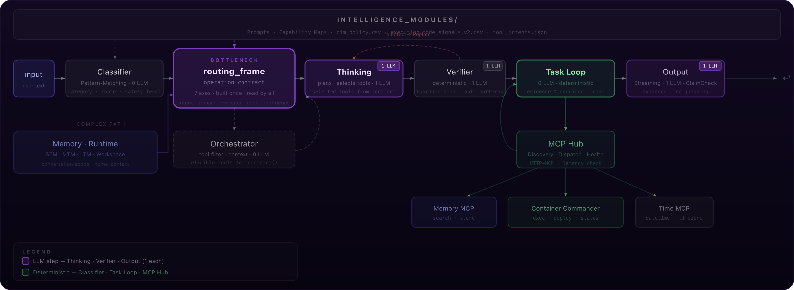
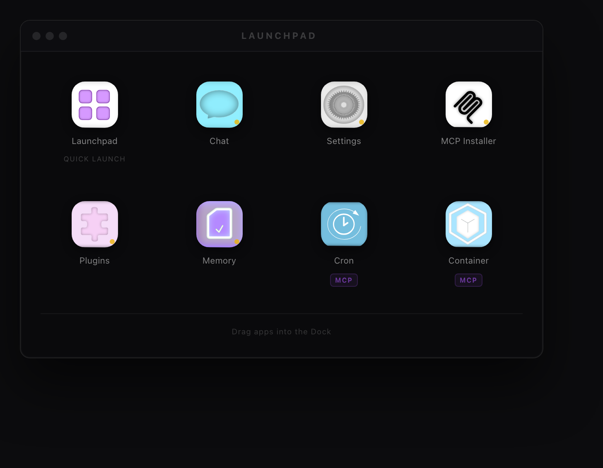
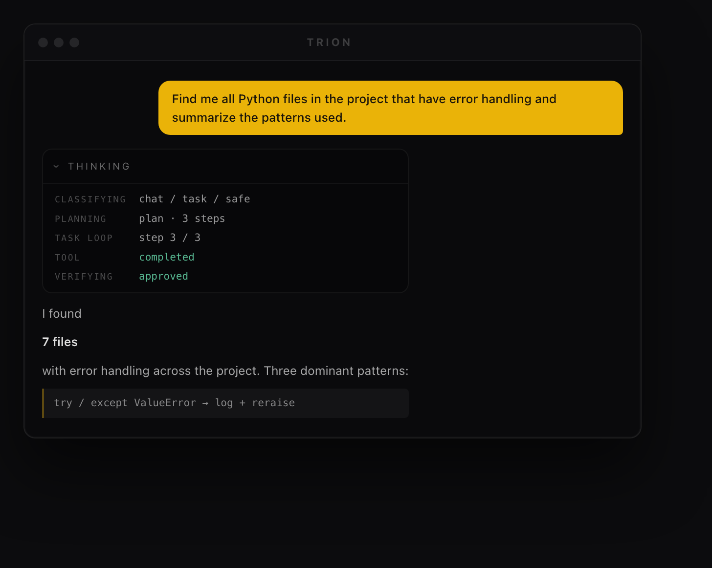
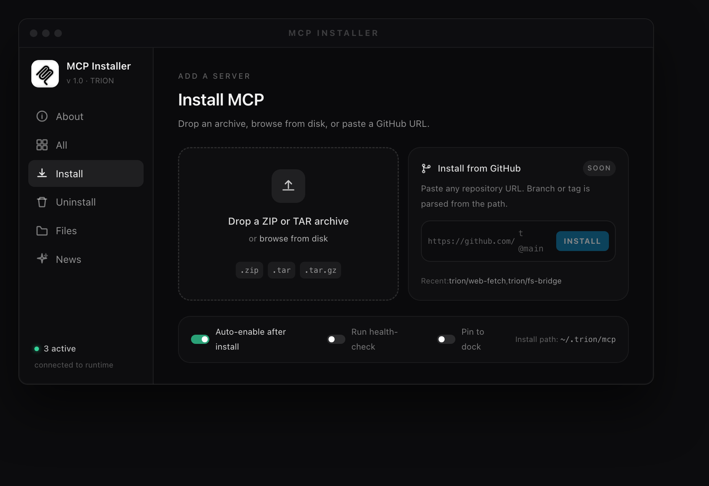

[](https://github.com/danny094/TRION-system/actions/workflows/ci.yml)
[](https://discord.gg/HDsSbSQaC)
[](LICENSE)


# TRION

**An open-source framework for AI agents whose behavior is predictable, auditable, and safe *by design* — because the rules that govern routing, tool use, and safety live in transparent configuration, not buried in code.**

---

## The problem

Most AI agents are unpredictable because their behavior is scattered across the codebase. The logic that decides *how* the agent responds, *which* tools it may use, and *how* safety is enforced is tangled into application source — so you can't easily see, verify, or change what the agent does without rewriting it.

TRION pulls that behavior **out of the code and into explicit, auditable rules**. The result is an agent you can reason about.

## What makes TRION different

TRION is built on three pillars:

### 1. Rule-driven, not code-driven
Agent behavior is governed by an explicit architectural pattern (**PIANO**) and lives in transparent configuration — routing policies, capability contracts, and safety rules — instead of being hard-coded. Behavior becomes predictable and changeable **without a rewrite**, and even non-developers can steer it through governed configuration rather than source edits.

### 2. Isolated, guarded capabilities
Every capability the agent can use runs as its own **isolated MCP server** (Container Commander, Memory, Skills, Cron), behind guarded, allow-listed tools. Capabilities are bounded, sandboxed, and auditable — the agent can only do what it has been explicitly granted.

### 3. Grounded output
A strict **evidence policy** ties answers to verified tool results. When TRION lacks grounded facts, it says so — a deliberate, narrow *"unknown"* fallback instead of a confident hallucination. Honesty is enforced by the pipeline, not left to the model's goodwill.

Together these map to a simple goal: agents that are **controllable, safe, and honest**.

## Architecture at a glance

A deterministic control-classifier routes every request; simple requests take the short path, complex ones enter a verified, tool-using task loop. Purple marks the (few) LLM steps, green the deterministic stages.



Every stage is small, testable, and replaceable. Output only leaves the pipeline after verification and grounding checks — and the whole path uses just three LLM calls.

## Provider-agnostic by design

TRION is not tied to a single model vendor. The LLM layer runs on a central provider registry, and each role — `CONTROL`, `THINKING`, `OUTPUT` — can be pointed at a different model.

**Supported providers:** OpenAI · Anthropic · OpenRouter · MiniMax · Ollama (local & cloud)

This means you can run TRION **fully local** with Ollama — no request ever leaves your machine — or point any individual role at a hosted model (OpenAI, Anthropic, OpenRouter, MiniMax, or Ollama Cloud). Local and cloud can be mixed per role: for example a small local `CONTROL` model with a hosted `OUTPUT` model.

API keys are never hard-coded — the target architecture stores them encrypted in the backend and resolves them internally at the LLM layer; the UI only ever sees status (`set`, `empty`, `test failed`), never plaintext.

## Your data & privacy

Your data stays on your machine. TRION collects nothing and phones home to no one. Memory lives in a local database on your own system — there are no cloud backups, so keeping regular backups is on you.

The only data that ever leaves your machine is what you deliberately send to a hosted model: if a role points at a cloud provider, those messages go to that provider under their terms — that's between you and them. Run local models via Ollama and everything, inference included, stays fully local — which also means TRION works completely offline.

## Quickstart

TRION ships with a minimal Docker stack (WebUI + Admin API + Memory):

```bash
docker compose up --build -d
```

This starts:
- `trion-webui` — the web interface (Vite / React / TypeScript)
- `trion-admin-api` — the backend (chat, models, workspace, routers)
- `trion-memory` — the SQL-backed memory server

Health checks: `GET /health` on both the Admin API and the WebUI.

> **Tested on:** macOS on Apple Silicon (M4). The stack is fully Docker-based, so it is expected to run on any Docker host — other platforms are simply not yet as widely tested. Ubuntu support is planned.

## A look at the WebUI

The WebUI is organized as a desktop-style workspace: a launchpad where each capability — Chat, Settings, Memory, Cron, Container, and the MCP Installer — is its own app.



The chat doesn't hide the pipeline behind the answer. The Thinking panel shows each stage live — classification, planning, task-loop progress, tool execution, and verification — so you can see *how* an answer was produced, not just the result:



New capabilities are added through the MCP Installer: drop a ZIP or TAR archive and the server is installed as its own isolated MCP server (install from a GitHub URL is coming soon):



## Concepts & deep dives

- [Architecture — the full pipeline](docs/architecture.md)
- [PIANO — the cognitive engine](piano_concept.md)
- [Operation Contract concept](operation_contract_concept.md)
- [TRION Meaning Representation (TMR)](tmr_concept.md)

## Project layout

```
TRION/
├── adapters/
│   ├── webui/          web interface (Vite/React/TS, direct Admin-API client)
│   └── admin-api/      backend: chat, models, workspace, routers
├── core/
│   ├── pipeline/       run_chat() — short path + task-loop entry
│   ├── classifier/     deterministic control-classifier (pattern routing)
│   ├── thinking/       analyzer / planner / replanner
│   ├── verifier/       deterministic + LLM plan verification
│   ├── output/         grounded answer generation + evidence guard
│   ├── orchestrator/   context assembly + tool selection
│   └── task_loop/      multi-step execution + replanner hook
├── mcp/                MCP hub + client + transports
├── mcp-servers/        isolated capability servers (container-commander, skills, cron)
├── memory/             SQL memory MCP server
├── intelligence_modules/  routing CSVs, prompts, prompt manager
├── tools/              tool executor
└── config/             environment configuration (no hard-coded values)
```

## Status

TRION is in **active development**. Working today: the core vertical slice (`Classifier → Thinking → Verifier → Output`), the multi-step task loop, the MCP layer with a live installer, the SQL memory server, the WebUI v2, and a Docker stack verified to build, start, and pass a chat smoke test. The read-only Container Commander v2 path and guarded start/stop tools run against a live container. Orchestrator, autonomous tool execution, and provider/secret management are actively being hardened.

> **⚠️ MCP layer under active revision.** The MCP structured-output and desired-state contracts (`mcp/`) are currently being reworked. Interfaces and payload shapes in that layer may change between commits — treat them as unstable until this note is removed.

## Known limitations

- **Chat is not persisted across reloads.** Reloading the WebUI clears the current conversation — the chat starts fresh. Session persistence is planned, but other fixes take priority first, so this is a known gap rather than a bug.

## Contributing & community

TRION is built in the open. Issues, ideas, and PRs are welcome — join the [Discord](https://discord.gg/HDsSbSQaC) to discuss architecture and direction.

If TRION helps you, you can support development via [GitHub Sponsors](https://github.com/sponsors/danny094).

Contact: trlon.devs.dk@gmail.com

## License

Copyright © 2026 Dennis

TRION is free software, licensed under the **GNU Affero General Public License v3.0 (AGPL-3.0)** — see [LICENSE](LICENSE). You may use, study, share, and modify it; if you run a modified version as a network service, you must make your source available under the same terms.

A separate **commercial license** (without the AGPL copyleft obligations) is available for organizations that cannot comply with the AGPL — contact trlon.devs.dk@gmail.com.
