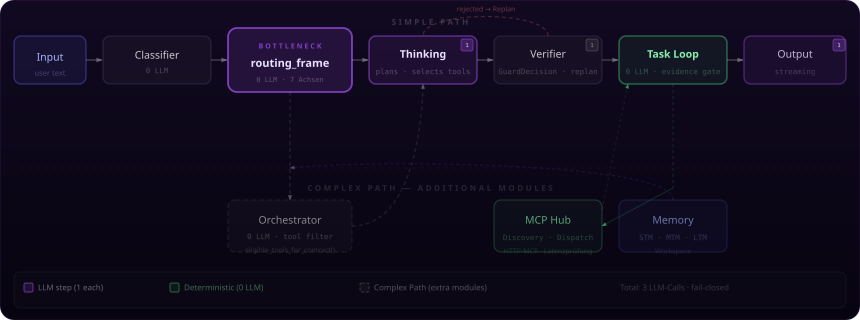

# The Pipeline

How TRION thinks. Two paths. Every step has exactly one job.

<div align="center">

</div>

---

## Overview

TRION processes every request sequentially through a fixed pipeline. No step re-interprets the request after the `routing_frame` is built. No downstream module draws its own conclusions from the raw text.

```
Input → Classifier → routing_frame → [Orchestrator] → Thinking → Verifier → Task Loop → Output
                           ↑                                  |
                      BOTTLENECK                      Replan on rejection
```

The `routing_frame` is the only place where meaning is decided. All following layers read the same immutable contract.

---

## Layers

### Classifier — 0 LLM

Pattern-matching on raw text. Outputs `category`, `route`, and `safety_level`. No semantic interpretation. No LLM call.

```
Input → category · route · safety_level
```

### routing_frame — 0 LLM · BOTTLENECK

The bottleneck of the entire pipeline. Built once, read by all.

```
operation_contract = {
  intent_kind,
  domain,
  evidence_need,
  execution_mode,
  confidence,
  ...  // 7 axes total
}
```

What the `routing_frame` decided applies to all downstream modules simultaneously. No module may re-interpret or overwrite this contract.

### Orchestrator — 0 LLM · Complex path only

Only runs when the `routing_frame` prescribes a complex path. Filters available tools against the `operation_contract` and collects context.

```python
eligible_tools = eligible_tools_for_contract(contract)
# without contract → eligible_tools = []
```

No LLM call. Deterministic.

### Thinking — 1 LLM

Plans the solution. Selects tools from the `eligible_tools` list. Writes the plan.

**Important:** Thinking can only recommend tools — never execute them. This prevents hallucinated tool calls.

Returns: `selected_tools`, `plan`, `reasoning`.

### Verifier — 1 LLM

Checks the Thinking step's plan against `GuardDecision` and `anti_patterns`.

```
plan → OK       → proceed to Task Loop
plan → rejected → Replan (back to Thinking)
```

Deterministic in its decision logic. The LLM call validates — it does not decide freely.

### Task Loop — 0 LLM

Executes tools deterministically. Collects evidence. Checks after every step:

```
done = required_evidence ⊆ observed_evidence
```

If the required evidence types haven't been collected, the task is not complete — regardless of whether a tool call returned `success`.

Communicates with the **MCP Hub** (tool dispatch), which discovers available tool servers and routes calls.

### Output — 1 LLM

Writes the response based on collected evidence. Streaming. ClaimCheck against available evidence — no guessing, no content without evidence.

---

## Two Paths

### Simple Path

Direct requests without tool usage. Orchestrator is skipped.

```
Input → Classifier → routing_frame → Thinking → Verifier → Task Loop → Output
```

### Complex Path

Requests that require tool usage, multi-step execution, or context collection.

```
Input → Classifier → routing_frame → Orchestrator → Thinking → Verifier → Task Loop → Output
                                           ↓
                                    eligible_tools_for_contract()
                                    Context collection
                                    Memory lookup
```

The Orchestrator is the only difference. It filters tools before Thinking plans.

---

## LLM Budget

| Layer | LLM Calls |
|---|---|
| Classifier | 0 |
| routing_frame | 0 |
| Orchestrator | 0 |
| Thinking | **1** |
| Verifier | **1** |
| Task Loop | 0 |
| Output | **1** |
| **Total** | **3** |

More than 3 LLM calls per request is an architecture error, not an optimisation problem.

---

## Note

The **Thinking** component can never execute tools — it can only recommend them. This prevents erroneous, hallucinated tool calls.

---

← [Back to overview](../README.md)
