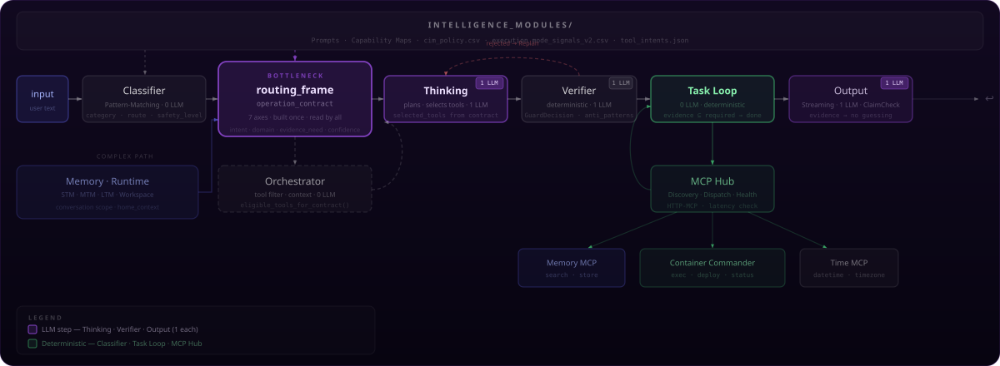

# System Map

All layers. No simplified picture. Two paths, one bottleneck, zero free model decisions.

<div align="center">

</div>

---

## What the map shows

The system map is the complete TRION architecture in a single view. It shows all layers — from input to output — including side modules like Memory, MCP Hub, and the complex path via the Orchestrator.

The map is static. All paths are visible simultaneously. For an interactive layer filter (simple path, tool calls, memory, etc.) → [trion.local/systemkarte](http://localhost:4321/systemkarte)

---

## Key points

### routing_frame

Built once. Read by all.

No downstream module re-classifies the request from raw text. What the frame says applies — for Orchestrator, Thinking, Task Loop, and Output simultaneously.

```
routing_frame → operation_contract → [Orchestrator | Thinking | Verifier | Task Loop | Output]
```

### Operation Contract

```
live_claim ≠ meaning ≠ operation
```

What the user says, what it means, and what the system is allowed to do — three separate layers. The contract is set once before any tool is considered. No module may re-interpret it.

### Task Loop

```
done = required_evidence ⊆ observed_evidence
```

Done does not mean "tool returned success." Done means the required evidence types were actually collected. No LLM, no guessing — deterministically measurable.

---

## Layers in detail

<details>
<summary><strong>Simple Path</strong> — Input · Classifier · routing_frame · Thinking · Verifier · Task Loop · Output</summary>

The default path for direct requests without extensive tool usage.

```
Input
  └→ Classifier (0 LLM · pattern-matching · category · route · safety_level)
      └→ routing_frame (0 LLM · BOTTLENECK · 7 axes · operation_contract)
          └→ Thinking (1 LLM · plans · selects tools from eligible_tools)
              └→ Verifier (1 LLM · GuardDecision · anti_patterns · Replan on rejection)
                  └→ Task Loop (0 LLM · deterministic · evidence gate)
                      └→ Output (1 LLM · streaming · ClaimCheck)
```

</details>

<details>
<summary><strong>Complex Path</strong> — Addition: Orchestrator between routing_frame and Thinking</summary>

For requests that require tool usage, multi-step execution, or context collection.

```
routing_frame
  └→ Orchestrator (0 LLM · eligible_tools_for_contract() · context collection · memory lookup)
      └→ Thinking (receives filtered tool list instead of all available tools)
```

The Orchestrator is deterministic. It does not decide — it filters against the contract.

</details>

<details>
<summary><strong>Tool Execution</strong> — Task Loop · MCP Hub · Tool Servers</summary>

```
Task Loop
  └→ MCP Hub (discovery · dispatch · health · latency check)
      ├→ Memory MCP          (search · store)
      ├→ Container Commander (exec · deploy · status)
      └→ Time MCP            (datetime · timezone)
```

The Task Loop never executes tool calls directly — it always communicates through the MCP Hub. The hub checks availability and latency before dispatching.

</details>

<details>
<summary><strong>Memory &amp; Context</strong> — STM · MTM · LTM · Workspace</summary>

```
Memory · Runtime
  ├→ STM  — Short Term Memory  (conversation scope)
  ├→ MTM  — Mid Term Memory    (cross-session)
  ├→ LTM  — Long Term Memory   (persisted)
  └→ Workspace                 (home_context · active files)
```

The `routing_frame` reads memory during construction. No downstream module writes back into the frame.

</details>

<details>
<summary><strong>Rules Layer</strong> — intelligence_modules/</summary>

```
intelligence_modules/
  ├→ Prompts                        → all LLM layers
  ├→ Capability Maps                → Orchestrator
  ├→ cim_policy.csv                 → Classifier
  ├→ execution_mode_signals_v2.csv  → routing_frame
  └→ tool_intents.json              → Orchestrator · Thinking
```

The rules layer sits above the entire pipeline. It controls behaviour through configuration — not through LLM decisions.

</details>

<details>
<summary><strong>Evidence Gate</strong> — Verifier · Task Loop · Output</summary>

Evidence checking happens at two points:

1. **Verifier** — checks the plan before execution
2. **Task Loop** — checks after each tool call whether `required_evidence ⊆ observed_evidence`

The Output only writes based on collected evidence. No content without evidence.

</details>

<details>
<summary><strong>Thinking</strong> — what Thinking can and cannot do</summary>

Thinking plans and selects tools. Thinking does **not** execute tools.

```python
# Thinking returns:
{
  "selected_tools": [...],  # from eligible_tools — no free selection
  "plan": [...],
  "reasoning": "..."
}
# Execution: Task Loop, not Thinking
```

This prevents hallucinated tool calls. Thinking is the only step that uses LLM creativity — but within fixed boundaries.

</details>

---

← [Back to overview](../README.md)
